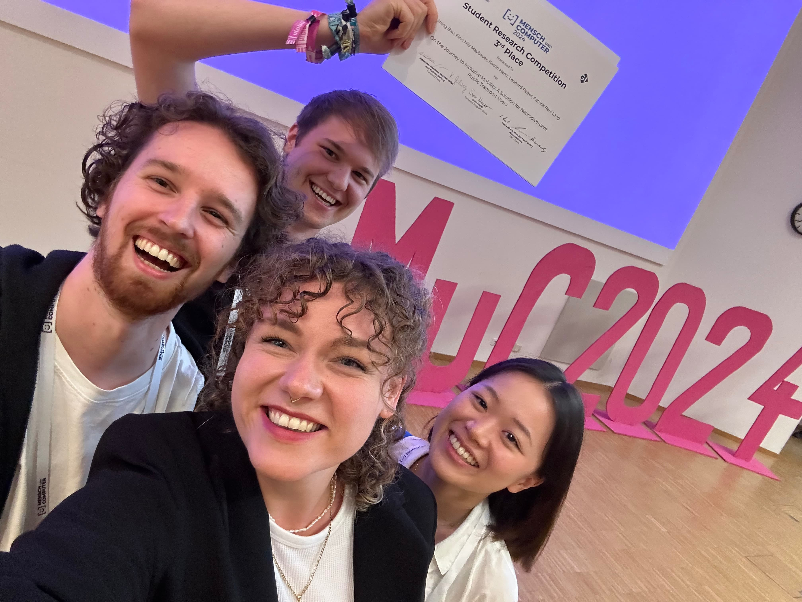

# ÖPNV-Navigation für neurodivergente Personen
im Rahmen der Module

**Projekt 1 bis 3** \
im Medieninformatik Master \
Schwerpunkt Human-Computer Interaction \
Technische Hochschule Köln \
Campus Gummersbach

**Team:**
- [Lining Bao](mailto:lining.bao@smail.th-koeln.de)
- [Finn Maybauer](mailto:finn_nils.gedrath@smail.th-koeln.de)
- [Katrin Hartz](mailto:katrin.hartz@smail.th-koeln.de)
- [Patrick Raul Lang](mailto:patrick_raul.lang@smail.th-koeln.de)
- [Leonard Pelzer](mailto:leonard.pelzer@smail.th-koeln.de)

**Projekt-Betreuer**
- Prof. Dr. Gerhard Hartmann

> **Kurzvorstellung:** \
> Für neurodivergente Personen stellt die Reise mit dem ÖPNV eine besondere Herausforderung dar. Reizüberflutung durch große Menschenansammlungen und kurzfristige Veränderungen am Fahrplan belasten diese Personengruppe im hohen Maße und grenzen diese von einer bezahlbaren und klimafreundlichen Mobilität aus. Unser konzeptionell entwickeltes System ist ein Begleiter in solchen überfordernden Situationen, in dem es indiviuell- und situativ-abhängige Unterstützung und Alternativen bietet. Im Gestaltungsprozess waren Werte wie Autonomie und Stärkung des Selbstbewusstsein besonders wichtig, mit dem Ziel Nutzende nicht vom System abhängig zu machen.

- [Projekt 1 / Vision und Konzept](https://neuro-inclusive-transit.github.io/vision-concept/)
- [Projekt 2 / Entwicklung](https://neuro-inclusive-transit.github.io/development/)
- Projekt 3 / Forschung, Evaluation/Assessment, Verwertung im Kontext des Studienschwerpunkts
  
[ Video über den Nutzungskontext ansehen... (Öffnet ein YouTube-Video)](https://youtu.be/stPYHTFElyI)

## Projekt bei der Mensch-und-Computer 2024 in Karlsruhe

Das Projekt wurde als Teil der Student-Research-Competition (SRC) bei der MuC 2024 als Paper eingereicht. Hier konnten wir den 3. Platz belegen. Das Research Paper ist hier einzulesen: <https://doi.org/10.18420/muc2024-mci-src-261>

